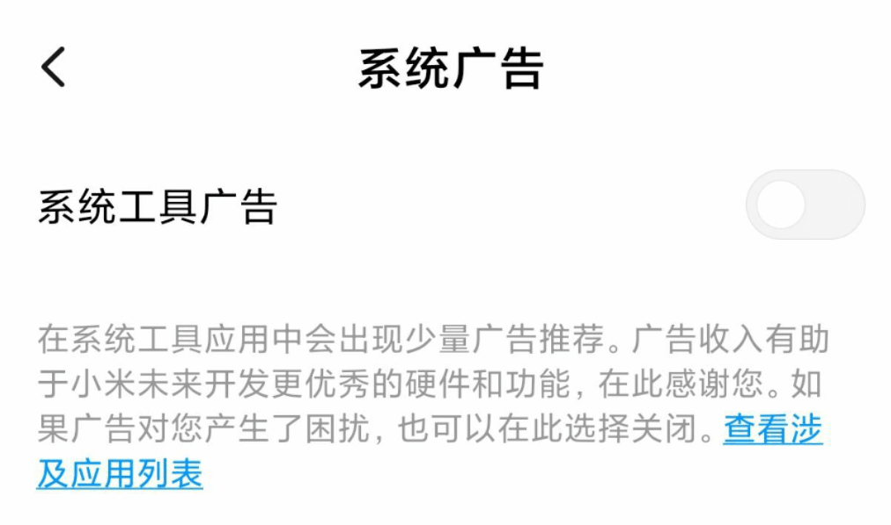

<p align="center">
    
</p>

---

## Manual

> 世界上有两种密码:一种是防止你的小妹妹偷看你的文件;另一种是防止当局阅读你的文件.

- Bruce Schneier《应用密码学》

<p align="center">
    <a href="https://en.wikipedia.org/wiki/Wojciech_Kossak"></a>
</p>

* **项目起因 :** 为了保护自己的隐私,慢慢的开始学习与收集各种手段方法、网站、工具,我把这种行为称作数字洁癖.这些手段方法藏着掖着也不能当传家宝,那干脆就分享出来造福大众.
* **涉及内容 :** 个人敏感信息查询,保护措施,开源信息收集(OSINT)对抗
* **事件集合 :** 还不清楚严重性？进来了解近年来的数据泄露、供应链污染事件:[Dork-Admin](https://github.com/ffffffff0x/Dork-Admin)
* **项目地址 :** https://github.com/ffffffff0x/Digital-Privacy

---

## 免责声明

1. `本项目所有内容,仅供学习和研究使用,请勿使用项目的技术手段用于非法用途,任何人造成的任何负面影响,与本人无关.`
2. `本文档所有内容、新闻皆不代表本人态度、立场,如果有建议或方案,欢迎提交 issues`
3. `未收及不会收取任何广告费用,推荐的所有工具链接与本人无任何利害关系`

**Tips**

1. 对于各类平台尽量使用不同昵称、头像.
2. 多平台不要使用统一、相似的密码,请建立一套自己的密码管理方式,推荐使用密码管理器.对于密码管理器本身的安全性,可以参考这个报告 https://www.securityevaluators.com/casestudies/password-manager-hacking/
3. 管住自己的炫耀欲.
4. 不要相信哪个公司不作恶、重视隐私.(感觉和2有冲突啊 XD)
5. 尽量少用部分浏览器 "记住密码" 的功能, 针对浏览器的取证工具不少, 很容易就可以提取出 Cookie、浏览记录、保存的密码等。
6. 不要以为开虚拟机、挂 vpn 就很安全,webRTC 泄露 IP,浏览器指纹,通过 DNS 判断(参考网飞),系统时间,浏览器 0day,等等等等.
7. 定时清空你的邮件、短信、通话记录、回收站.
8. 所以不要干坏事、不要干坏事、不要干坏事。

---

## 大纲

* **[敏感信息](#敏感信息)**
    * [隐私查询](#隐私查询)
    * [浏览器指纹](#浏览器指纹)
    * [密码泄露查询](#密码泄露查询)
    * [DNS信息](#dns信息)
    * [定位](#定位)

* **[保护措施](#保护措施)**
    * [操作系统](#操作系统)
    * [软件-脚本](#软件-脚本)
    * [浏览器扩展](#浏览器扩展)
    * [安全删除](#安全删除)
    * [加密](#加密)
    * [flash](#flash)
    * [輸入法](#輸入法)
    * [搜索引擎](#搜索引擎)
    * [身份生成](#身份生成)
    * [邮箱-信息](#邮箱-信息)
        * [查邮箱存活](#查邮箱存活)
        * [短信接码](#短信接码)
        * [临时邮箱](#临时邮箱)
        * [匿名邮箱](#匿名邮箱)
    * [平台管控设置](#平台管控设置)

* **[OSINT](#osint)**
    * [设备-语音助手](#设备-语音助手)
    * [平台-软件](#平台-软件)
    * [社交网络](#社交网络)
    * [各类搜索](#各类搜索)
        * [常用搜索引擎](#常用搜索引擎)
        * [网页快照](#网页快照)
        * [图片反向搜索](#图片反向搜索)
            * [acg图片反向搜索](#acg图片反向搜索)
        * [航班/飞机信息](#航班/飞机信息)
        * [船舶信息](#船舶信息)
        * [货车位置](#货车位置)
        * [物流信息](#物流信息)
        * [车辆信息](#车辆信息)
            * [VIN码](#vin码)
        * [个人可信度](#个人可信度)
        * [网络空间测绘](#网络空间测绘)
        * [tor信息](#tor信息)
        * [学术信息](#学术信息)
        * [专利-商标](#专利-商标)
        * [报刊信息](#报刊信息)
        * [开放数据集](#开放数据集)
        * [BGP信息](#bgp信息)
        * [电子硬件相关](#电子硬件相关)
        * [社交-人际关系](#社交-人际关系)
        * [企业信息](#企业信息)
        * [博客搜索](#博客搜索)
    * [文件资源](#文件资源)
        * [PDF](#pdf)
        * [音乐](#音乐)
    * [天气-环境](#天气-环境)
    * [地图](#地图)
        * [数据展示](#数据展示)
        * [网络威胁](#网络威胁)

---

# 敏感信息

## 隐私查询

- **从邮箱查询**
    - [你注册过哪些网站？一搜便知](https://www.reg007.com/)
    - [Find email addresses in seconds • Hunter (Email Hunter)](https://hunter.io/) - email 信息查询工具

- **从用户名查询**
    - [Instant Username Search](https://instantusername.com/#/) - 实时搜索100多个社交媒体网站的用户名。
    - [CheckUsernames](https://checkusernames.com/) - 测某账号是否在全球500多个社交媒体中是否有注册。
    - [WhatsMyName Web](https://whatsmyname.app/) - 搜索许多网站上存在的用户名。
    - [NameCheckup](https://namecheckup.com/) - 查找可用的用户名
    - [Namechk](https://knowem.com/)
    - [KnowEm Username Search](https://namechk.com/)
    - [sherlock-project/sherlock](https://github.com/sherlock-project/sherlock) - 在不同的社交网络上通过用户名搜寻账户

- **从IP查询**
    - [Torrent downloads and distributions for IP](http://iknowwhatyoudownload.com/) - 查你这个IP下载过哪些磁力链接🔗 (太缺德了😂)

- **混合查询**
    - [Username Search](https://usersearch.org/) - 找到用户名、电子邮件地址或电话号码背后的人。
    - [n0tr00t/Sreg](https://github.com/n0tr00t/Sreg) - 使用者通过输入 email、phone、username 的返回用户注册的所有互联网信息.

---

## 浏览器指纹

- [Am I unique?](https://amiunique.org/fp) - 显示了你的操作系统、浏览器、浏览器版本以及你的时区和语言。
- [Unique Machine](http://uniquemachine.org/) - 这是一个浏览器指纹技术的项目，它不仅可以在一个浏览器内跟踪用户，还可以在同一台机器上的不同浏览器间跟踪用户。
- [Panopticlick](https://panopticlick.eff.org/) - 分析你的浏览器和附加组件对在线追踪技术的保护程度。
- [Detect Canvas Fingerprint](https://webbrowsertools.com/canvas-fingerprint/) - 这个页面使用不同的技术来识别是否安装了浏览器扩展来欺骗 canvas 指纹结果。
- [What is my User Agent](https://webbrowsertools.com/useragent/) - 检测网站服务器和客户端代码在访问网站时看到的用户代理字符串。
- [Sploit.io](https://sploit.io/) - 这个网页可以测试你在浏览网页的时候到底会暴露出哪些信息出去；从漏洞，到地理位置，到浏览器指纹，用没用代理等等。
- [Supercookie](https://supercookie.me/) - 这个网站可以通过浏览器访问过的图标来识别用户指纹。

- **相关文章**
    - [浏览器指纹](https://wzyboy.im/post/1130.html)
    - [2.5代指纹追踪技术—跨浏览器指纹识别](https://www.freebuf.com/articles/web/139984.html)
    - [浏览器指纹真的有效吗？](http://www.arkteam.net/?p=4147)
    - [浏览器的隐身模式有多隐身？](https://www.solidot.org/story?sid=61446)
    - [Cookieless cookies](http://lucb1e.com/rp/cookielesscookies/) - 一种不使用 cookies 甚至是 Javascript 的方式来追踪用户。网站解释了它是如何工作的，以及如何保护自己。
- **webRTC**
    - [ 你的VPN泄漏IP了吗:仍有20%的VPN服务商未解决WebRTC漏洞问题 ](https://www.freebuf.com/articles/web/166754.html)
- **leak HTTP**
    - [cure53/HTTPLeaks](https://github.com/cure53/HTTPLeaks) - 对于网页泄漏 HTTP 请求的方法总结

**案例**
- [Stripe is Silently Recording Your Movements On its Customers' Websites](https://mtlynch.io/stripe-recording-its-customers/) - Stripe 在客户网站上隐秘记录用户访问 URL 和鼠标光标移动等信息

---

## 密码泄露查询

- [DeHashed](https://dehashed.com/) - 可通过用户名、邮箱、地址等搜索是否在该网站收集的一百多亿条信息内。
- [Have I Been Pwned](https://haveibeenpwned.com/) - 通过查询用于注册的邮箱，发现是否有相关密码被盗。
- [pwd query](https://pwdquery.xyz/) - 检查你的密码是否已经从数据泄露中泄露了......
- [Firefox Monitor](https://monitor.firefox.com/) - 可通过邮箱搜索看看你是否已经成为了网络数据泄露的一部分。
- [Vigilante.pw](https://vigilante.pw/) - 搜索数据泄露事件,数据库列表
- [OCCRP Aleph](https://aleph.occrp.org/) - 可通过搜索名字、账号、邮箱等查询相关泄露信息情况。
- [Snusbase](https://snusbase.com/) - 搜索电子邮件，名称和用户名，IP地址，电话，哈希或密码，检测自己的信息是否已泄露。
- **泄露密码库**
    - https://cloud.mail.ru/public/2eHX/38Ek7Lmfx?tdsourcetag=s_pctim_aiomsg
    - https://downloads.skullsecurity.org/passwords/

---

## DNS信息

- [DNS leak test](https://dnsleaktest.com/) - 检测 DNS 泄露的网站
- [What's My DNS Server?](http://www.whatsmydnsserver.com/) - 该网站通过观察你的 DNS 请求在互联网上的处理方式，主动确定你的计算机使用的 DNS 服务器。

---

## 定位

**案例**
- [看我如何通过邮箱获取IP定位](https://www.freebuf.com/articles/database/185954.html)
- [利用Wireshark任意获取QQ好友IP实施精准定位](https://www.freebuf.com/articles/web/137952.html)
- [跨国定位手机の奥义](https://mp.weixin.qq.com/s/K-zFVBaSw6yThuoLdUTjdg)
- [For sale: Systems that can secretly track where cellphone users go around the globe - The Washington Post](https://www.washingtonpost.com/business/technology/for-sale-systems-that-can-secretly-track-where-cellphone-users-go-around-the-globe/2014/08/24/f0700e8a-f003-11e3-bf76-447a5df6411f_story.html) - 利用 SS7 信令漏洞跟踪全球手机用户的系统
- [Using the Sun and the Shadows for Geolocation](https://www.bellingcat.com/resources/2020/12/03/using-the-sun-and-the-shadows-for-geolocation/) - 通过阳光和阴影进行定位

**GPS 定位**
- [MyGeoPosition.com](http://mygeoposition.com/) - 免费地理编译,地理译码 / 地理元数据标记 (Geo-Metatag) / 地理标记(Geotag) / KML 文件!
- [RTBAsia ODX](https://ip.rtbasia.com/) - Open Data Exchange
- [拾取坐标系统](http://api.map.baidu.com/lbsapi/getpoint/index.html)
- [openGPS.cn](https://www.opengps.cn/) - 传统 IP 定位
- [经纬度在线查询](http://map.yanue.net/)
- [免费的客户端反向地理编码](https://www.bigdatacloud.com/geocoding-apis/free-reverse-geocode-to-city-api)

**基站定位**
- [minigps](http://www.minigps.net/cellsearch.html) - 基站定位查询

**手机号码查询**
- [138查](http://www.ip138.com:8080/search.asp) - 手机归属地查询
- [手机号码定位](http://shouji.ip38.com/)
- [Reverse Phone Lookup | Phone Number Search - Spokeo](https://www.spokeo.com/reverse-phone-lookup) - 将姓名和身份与未知电话号码进行匹配
- [CarrierLookup](https://www.carrierlookup.com/) - 反查电话

**IP 信息**
- [RIPEstat](https://stat.ripe.net/) - Internet Measurements and Analysis
- [IP Info](https://ip.voidsec.com/) - IP 信息
- [What is your IP, what is your DNS](https://ipleak.net/) - IP/DNS Detect
- [ip8](https://ip8.com/) - IP Lookup Tool
- [查看自己的IP地址](https://whoer.net/zh)
- [IPList](https://iplist.cc/)
- [Plot IP](http://plotip.com/ip) - IP Addresses
- [DB-IP](https://db-ip.com/) - IP Geolocation API and databases
- [BigDataCloud](https://www.bigdatacloud.com/) - Essential IP Geolocation APIs
- [IPIP.NET](https://www.ipip.net/) - IP 地址库
- [IP查询](http://www.123cha.com/)
- [ip查询](http://www.hao7188.com/)
- [Whois](http://ipwhois.cnnic.net.cn/)
- [查错网](http://ipblock.chacuo.net/) - 国家 IP 段查询、全球国家 IP 段
- [ipplus360.com](http://www.ipplus360.com/) - 全球 IP 地址定位平台
- [openGPS.cn](https://www.opengps.cn/Data/IP/LocHighAcc.aspx) - 高精度 IP 定位
- [IP地址查询](http://ip38.com/)
- [多数据源IP地址查询](https://haoip.cn/)
- [Get your IPv4 and IPv6 address instantly](https://eyep.dev/)
- [What is my IP Address](https://webbrowsertools.com/ip-address/)
- [What Is My IP Address?](https://ifconfig.me/)
- [ipapi](https://ipapi.co/) - IP Address Location
- [IPinfo.io](https://ipinfo.io/) - IP Address API and Data Solutions

**IPv6 信息**
- [IPv6地址查询工具](http://ip.zxinc.org/ipquery/)
- [Locate IPv6 Address Online](https://dnschecker.org/ipv6-whois-lookup.php) - IPv6 Whois Lookup
- [findIPv6](https://findipv6.com/find/) - Lookup and locate an IPv6 address

**邮箱**
- [Email Search | Reverse Email Lookup - Spokeo](https://www.spokeo.com/email-search) - 查询任何电子邮件以查看谁拥有它

---

# 保护措施

**文章**
- [GoogleAlternatives - FuckOffGoogle](https://wiki.fuckoffgoogle.de/index.php?title=GoogleAlternatives) -  - 谷歌工具替代品清单
- [No More Google](https://nomoregoogle.com/) - 谷歌工具替代品清单
- [安全手册:这里是你需要的几乎所有安全上网工具;以及为什么建议不要使用以美国为基地的网络服务](https://steemit.com/life/@iyouport/7nfymr)
- [隱私工具 - 加密安全對抗全球大規模監控](https://privacytools.twngo.xyz/)
- [Security Checklist](https://securitycheckli.st/)
- [终极在线隐私指南](https://www.bestvpn.com/guides/the-ultimate-privacy-guide/#avoidus)
- [隐私大爆炸,你得学几招保护自己](https://evilcos.me/yinsi.html)
- [如何知道有人正在线人肉你？6个简单的方法](https://www.iyouport.org/%E5%A6%82%E4%BD%95%E7%9F%A5%E9%81%93%E6%9C%89%E4%BA%BA%E6%AD%A3%E5%9C%A8%E7%BA%BF%E4%BA%BA%E8%82%89%E4%BD%A0%EF%BC%9F6%E4%B8%AA%E7%AE%80%E5%8D%95%E7%9A%84%E6%96%B9%E6%B3%95/)

## 操作系统

- [Tails](https://tails.boum.org/about/index.en.html)
- [Qubes OS](https://www.qubes-os.org/)
- [Whonix](https://www.whonix.org/)

---

## 软件-脚本

- **浏览器**
    - [Eloston/ungoogled-chromium](https://github.com/Eloston/ungoogled-chromium)

- **通讯**
    - [telegram](https://telegram.org/)

- **网络审计**
    - [W10Privacy](https://www.winprivacy.de/english-home/)
    - [abcnews/data-life](https://github.com/abcnews/data-life)

- **匿名**
    - [tor](https://www.torproject.org/)
    - [i2p/i2p.i2p](https://github.com/i2p/i2p.i2p)

---

## 浏览器扩展

- **chrome**
    - [Decentraleyes](https://chrome.google.com/webstore/detail/decentraleyes/ldpochfccmkkmhdbclfhpagapcfdljkj)
    - [Cookie AutoDelete](https://chrome.google.com/webstore/detail/cookie-autodelete/fhcgjolkccmbidfldomjliifgaodjagh)
    - [LastPass Password Manager](https://chrome.google.com/webstore/detail/lastpass-free-password-ma/hdokiejnpimakedhajhdlcegeplioahd)
    - [Privacy Badger](https://chrome.google.com/webstore/detail/privacy-badger/pkehgijcmpdhfbdbbnkijodmdjhbjlgp)
    - [User-Agent Switcher for Chrome](https://chrome.google.com/webstore/detail/user-agent-switcher-for-c/djflhoibgkdhkhhcedjiklpkjnoahfmg)
    - [HTTPS Everywhere](https://chrome.google.com/webstore/detail/https-everywhere/gcbommkclmclpchllfjekcdonpmejbdp)
    - [NoScript](https://chrome.google.com/webstore/detail/noscript/doojmbjmlfjjnbmnoijecmcbfeoakpjm)
    - [uBlock Origin](https://chrome.google.com/webstore/detail/ublock-origin/cjpalhdlnbpafiamejdnhcphjbkeiagm)

- **firefox🦊**
    - [Decentraleyes](https://addons.mozilla.org/en-US/firefox/addon/decentraleyes/)
    - [Cookie AutoDelete](https://addons.mozilla.org/en-US/firefox/addon/cookie-autodelete/)
    - [LastPass Password Manager](https://addons.mozilla.org/en-US/firefox/addon/lastpass-password-manager/?src=search)
    - [Privacy Badger](https://addons.mozilla.org/en-US/firefox/addon/privacy-badger17/?src=search)
    - [User-Agent Switcher and Manager](https://addons.mozilla.org/zh-CN/firefox/addon/user-agent-string-switcher/?src=search)
    - [HTTPS Everywhere](https://addons.mozilla.org/zh-CN/firefox/addon/https-everywhere/?src=search)
    - [NoScript](https://addons.mozilla.org/zh-CN/firefox/addon/noscript/?src=search)
    - [uBlock Origin](https://addons.mozilla.org/zh-CN/firefox/addon/ublock-origin/?src=search)

- **stylish**
    - ["Stylish" browser extension steals all your internet history](https://robertheaton.com/2018/07/02/stylish-browser-extension-steals-your-internet-history/)
    - [Stylus is a Stylish fork without analytics](https://www.ghacks.net/2017/05/16/stylus-is-a-stylish-fork-without-analytics/)

## 安全删除

- [如何:在Windows上安全地删除数据](https://ssd.eff.org/en/module/how-delete-your-data-securely-windows)

---

## 加密

- [VeraCrypt](https://www.veracrypt.fr/en/Home.html)
- [VHD虚拟磁盘+BitLocker加密](https://bbs.kafan.cn/thread-2115703-1-1.html)

---

## flash

`最好的选择就是远离flash`

- [支持到32_0_0_223_Adobe{过}{滤}FlashPlayer去区域限制](https://bbs.kafan.cn/thread-2123485-1-1.html)

---

## 輸入法

- [RIME](https://github.com/rime)

---

某狗输入法参考文章 [SougouCloud.exe 浅析](https://bbs.kafan.cn/thread-2169610-1-1.html)

---

## 搜索引擎

`以下是在隐私保护方面较为优秀的搜索引擎,但其搜索质量不敢保证`

- [DuckDuckGo](https://start.duckduckgo.com/)
- [searx.me](https://searx.me/)
- [StartPage Web Search](https://www.startpage.com/)

---

## 身份生成

- [Generate a Random Name](https://www.fakenamegenerator.com/) - 随机身份生成
- [Fake Address, Random Address Generator](https://www.fakeaddressgenerator.com/Index/index) - 随机身份生成
- [Behind the Name](https://www.behindthename.com/random/) - Random Name Generator
- [Easy Random Name Picker](https://randomwordgenerator.com/name.php) - Random Name Generator
- [ElfQrin](https://www.elfqrin.com/fakeid.php) - Fake Identity ID Random Name Generator
- [Random User Generator](https://randomuser.me/)
- [在线身份证号码生成器](http://jbjb.zouri.jp/)
- [中国大陆内地姓名、身份证号、银行卡号生成器](http://jsrun.net/square?page=1&s=%E8%BA%AB%E4%BB%BD%E8%AF%81%E5%8F%B7)
- [在线身份证号码生成器](https://id.ifreesite.com/)
- [airob0t/idcardgenerator 身份证图片生成工具](https://github.com/airob0t/idcardgenerator)
- [gh0stkey/RGPerson](https://github.com/gh0stkey/RGPerson) - 随机身份生成脚本
- [naozibuhao/idcard](https://github.com/naozibuhao/idcard) - 身份证生成器
- [Just Delete Me](https://backgroundchecks.org/justdeleteme/fake-identity-generator/) - 假身份生成器(这个网站的图标,好像在哪里看过🤔)
- [Fake Person/Name Generator | User Identity, Account and Profile Generator](https://fakepersongenerator.com/)
- [faker.js](https://cdn.rawgit.com/Marak/faker.js/master/examples/browser/index.html)
- [Fake Person/Name Generator](https://www.fakepersongenerator.com/Index/generate)
- [Full Contact Information Generator](https://names.igopaygo.com/people/full-contact)

**图片生成**
- [伪造人像](https://thispersondoesnotexist.com)
- [Artbreeder](https://artbreeder.com/browse)
- [Comixify](https://comixify.ii.pw.edu.pl/)
- [This Waifu Does Not Exist - Gwern](https://www.thiswaifudoesnotexist.net/?ref=appinn)
- [虚拟猫咪](https://thiscatdoesnotexist.com/)
- [Which Face is Real?](http://www.whichfaceisreal.com/)
- [SPADE Project Page](https://nvlabs.github.io/SPADE/)
- [Selfie2Anime](https://selfie2anime.com/)
- [Reflect.tech](https://reflect.tech/faceswap/hot)
- [Gallery of AI Generated Faces | Generated.photos](https://generated.photos/faces)
- [ピクセルミー | ドット絵ジェネレーター](https://pixel-me.tokyo/en)

---

## 照片信息

**EXIF信息**
- [EXIF信息查看器](https://exif.tuchong.com/)
- [ExifShot App](https://exifshot.com/app/)
- [如何为老照片添加 Exif 日期数据？ - 小众软件](https://www.appinn.com/how-to-add-exif-date-for-old-picture/)

**相关文章**
- [The Secret Life Of JPEGs – NixIntel](https://nixintel.info/osint/the-secret-life-of-jpegs/)

---

## 邮箱-信息

### 查邮箱存活

- [Email地址检查、检测Email地址真实性、检测电子邮件地址真实性--查错网](http://tool.chacuo.net/mailverify)
- [Verify Email Address Online - Free Email Verifier - Free Email Address Verification](https://verify-email.org/)
- [免费在线批量验证邮箱有效性 - EmailCamel.com](http://www.emailcamel.com/)
- [Email Verifier - Verify Email Address For Free With Our Verifier Tool](https://www.verifyemailaddress.org/)

### 短信接码

`注:此类平台来的快,去的快,慎用`

> 以下部分内容来自 <sup>[[国内外短信接码平台合集 | 合集网](https://www.heji.ltd/28.html#)]</sup><sup>

**国外免费接码平台**
```
http://sms.sellaite.com
https://ch.freephonenum.com
https://zh.mytrashmobile.com
https://www.receive-sms-online.info
https://sms-online.co/receive-free-sms
https://receive-sms.com
http://receivefreesms.com/
https://www.receivesmsonline.net/
https://www.freeonlinephone.org/
https://us-phone-number.com
https://temporary-phone-number.com
https://www.receivesms.co/
https://pingme.tel/receive-sms-online-cn/
http://receivefreesms.net/
http://receivesmsonline.in/
https://sms-receive.net/
https://www.receivesms.net/
https://www.textnow.com/
http://receive-sms-now.com/
http://receive-sms-online.com/
https://www.afreesms.com/freesms/
https://textfree.us/#/login
http://receivesmsverification.com/
http://freereceivesmsonline.com/
```

**国内免费接码平台**
```
https://www.bfkdim.com/
https://www.yinsiduanxin.com/
https://www.materialtools.com/
http://www.114sim.com/
http://zg.114sim.com/
http://z-sms.com/
https://www.zusms.com/
https://yunjiema.net/
http://jiema.tech/
https://mianfeijiema.com/
http://www.xnsms.com/
https://xinghai.party/
https://jiemahao.com/
https://www.lothelper.com/cn
http://www.zsrq.net/
http://www.kakasms.com/
https://www.suiyongsuiqi.com/zh/
http://www.z-sms.com/
https://yunduanxin.net/
```

**国外收费接码平台**
```
https://sms-activate.ru/cn/ 1$起充，有中文页面
https://5sim.net
http://smspva.com
http://give-sms.com 俄罗斯接码平台
https://onlinesim.ru/zh 就俄罗斯的码便宜，每个码最少1卢布
https://www.smsjiema.com/ 美国实体卡号码，可以注册GV
https://www.textverified.com/ 2刀起充，接码也挺贵的
https://autofications.com/ 不算贵也不算便宜，最低$0.5一个码
https://service.pvaverify.com/ 美国实体卡
https://getsms.online/ 俄罗斯接码平台
```

**国内收费接码平台**
```
JieMa.Tech：https://f4.work
随用随弃：https://www.suiyongsuiqi.com
```

### 临时邮箱

`注:此类平台来的快,去的快,慎用`

```
http://www.yopmail.com/zh/
https://10minutemail.com/
https://10minutemail.net/
https://www.guerrillamail.com/zh/inbox
http://www.fakemailgenerator.com/#/dayrep.com/Firly1970/
https://temp-mail.org/en/
https://www.guerrillamail.com/
http://tool.chacuo.net/mailsend
https://maildrop.cc/
http://tool.chacuo.net/mailanonymous
https://tempmail.altmails.com/
https://www.snapmail.cc/
https://www.linshi-email.com/

```

### 匿名邮箱

- [ProtonMail](https://mail.protonmail.com/inbox)
- [Get secure, reliable email hosting – FastMail](https://www.fastmail.com/)
- [xyfir/ptorx](https://github.com/xyfir/ptorx)
- [Tutanota](https://tutanota.com/)

---

## 平台管控设置

- **baidu**
    - [应用授权](https://passport.baidu.com/accountbind?tpl=)

- **Facebook**
    - [应用授权](https://www.facebook.com/settings?tab=applications)

- **github**
    - [应用授权](https://github.com/settings/applications)

- **google**
    - [广告个性化/谷歌眼中的你](https://adssettings.google.com/authenticated)
    - [活动记录](https://myactivity.google.com/myactivity)
    - [活动控件](https://myaccount.google.com/activitycontrols?pli=1)
    - [最近使用过的设备](https://myaccount.google.com/device-activity)
    - [应用授权](https://myaccount.google.com/permissions)
    - 扩展阅读
        - [自動刪除你的 Google 網路和應用程式活動紀錄設定教學](https://free.com.tw/google-automatically-delete-data/)

- **Microsoft**
    - [产品和服务的隐私设置,以及查看和清除 Microsoft 保存到云的数据的位置](https://account.microsoft.com/privacy/activity-history)
    - [应用授权](https://account.live.com/consent/Manage)

- **twitter**
    - 应用授权 [旧版](https://twitter.com/settings/sessions) [新版](https://twitter.com/settings/applications)
    - [興趣和廣告資料](https://twitter.com/settings/your_twitter_data/ads)
    - [密碼重設保護](https://twitter.com/settings/security)

- **tencent**
    - [广告个性化](https://privacy.qq.com/advertisement.htm)
    - [应用授权](https://connect.qq.com/manage.html#/appauth/user)
    - 微信应用授权 [设置 - 隐私 - 授权管理]

---

# OSINT

> OSINT(Open-source intelligence) 指开源情报,一项从媒体、网络、博客、视频，等公开来源中进行信息收集、提取的技术。

**相关的网站与资源**
- [丁爸网](http://dingba.top/)
- 微信公众号 情报小蜜蜂 little_bee007
- [iYouPort OSINT专栏](https://www.iyouport.org/category/osint/)
- [sinwindie/OSINT](https://github.com/sinwindie/OSINT) - 各种平台的 OSINT "一张图" 系列
- [blaCCkHatHacEEkr/OSINT_TIPS](https://github.com/blaCCkHatHacEEkr/OSINT_TIPS) - OSINT 技巧合集
- [The Privacy, Security, & OSINT Show](https://inteltechniques.com/podcast.html) - 讲述、介绍各类 OSINT 技能的博客
- [OSINT Framework](https://osintframework.com/) - 非常著名的 OSINT 框架,有着非常丰富的 OSINT 资源

**案例**
- [Using Flight Tracking For Geolocation – Quiztime 30th October 2019 – NixIntel](https://nixintel.info/osint/using-flight-tracking-for-geolocation-quiztime-30th-october-2019/) - 通过一张照片中的飞机轨迹寻找到目标地址的案例
- [A Guide to Open Source Intelligence (OSINT) - Columbia Journalism Review](https://www.cjr.org/tow_center_reports/guide-to-osint-and-hostile-communities.php) - 一份 OSINT 指南,汇总了很多案例
- [Intelligence Gathering on U.S. Critical Infrastructure - Industrial Control Systems (ICS) Cyber Security Conference](https://www.icscybersecurityconference.com/intelligence-gathering-on-u-s-critical-infrastructure/) - 一篇对于美国工控领域设备的 OSINT 分析文章
- [bellingcat - A Beginner's Guide To Flight Tracking - bellingcat](https://www.bellingcat.com/resources/how-tos/2019/10/15/a-beginners-guide-to-flight-tracking/) - 一篇关于追踪飞机的文章
- [如果只知道一个电话号码，你能挖出多少有效信息？](https://www.iyouport.org/%e5%a6%82%e6%9e%9c%e5%8f%aa%e7%9f%a5%e9%81%93%e4%b8%80%e4%b8%aa%e7%94%b5%e8%af%9d%e5%8f%b7%e7%a0%81%ef%bc%8c%e4%bd%a0%e8%83%bd%e6%8c%96%e5%87%ba%e5%a4%9a%e5%b0%91%e6%9c%89%e6%95%88%e4%bf%a1%e6%81%af/)
- [GeoPrivacy and news media. Earlier this week I read a news article…](https://medium.com/@bearhunt38/geoprivacy-and-news-media-bc83b53dd818) - 查询新闻中鬼屋的真实位置
- [Finding McAfee: A Case Study on Geoprofiling and Imagery Analysis](https://medium.com/@benjamindbrown/finding-mcafee-a-case-study-on-geoprofiling-and-imagery-analysis-6f16bbd5c219) - 通过一张图片分析McAfee的位置
- [Tracking ships and visualize them in QGIS](https://medium.com/analytics-vidhya/tracking-ships-and-visualize-them-in-qgis-35c074810937) - 使用QGIS可视化跟踪目标船只
- [OSINT Amateur Hour](https://www.secjuice.com/geolocation-osint-amateur-hour/) - 调查照片位置的案例
- [一张快递单到底能泄露多少个人信息](https://mp.weixin.qq.com/s/8J5gXf-h0V6eVHRMReW6rw)
- [已知邮箱，求手机号码?](https://mp.weixin.qq.com/s/XvMruURNVWBkEwxvnPSW1g)
- [【图片挖掘】国外图片挖掘案例（附过程及工具）](https://mp.weixin.qq.com/s/D3oNR1HW8B23VqXhoNpE6Q)
- [Bringing VandaTheGod down to Earth: Exposing the person behind a 7-year hacktivism campaign](https://research.checkpoint.com/2020/vandathegod/) - checkpoint 社工 VandaTheGod 的案例
- [Subtle Information Hackers Find in the Background of Your Social Media Photos](https://medium.com/digital-marketing-lab/subtle-information-hackers-find-in-the-background-of-your-social-media-photos-938ec1876246) - 常见的通过图片泄露敏感信息的案例
- [Corporate Reconnaissance](https://osintcurio.us/2020/03/17/corporate-reconnaissance/) - 介绍如何挖掘一家企业的相关信息
- [寻找时间的踪迹：侦探挑战游戏](https://www.iyouport.org/%E5%AF%BB%E6%89%BE%E6%97%B6%E9%97%B4%E7%9A%84%E8%B8%AA%E8%BF%B9%EF%BC%9A%E4%BE%A6%E6%8E%A2%E6%8C%91%E6%88%98%E6%B8%B8%E6%88%8F/)
- [如何获取、挖掘、分析各种来源的调查数据完整指南：解码秘密（4）- 确保真实和确保道德的技巧](https://www.iyouport.org/%E5%A6%82%E4%BD%95%E8%8E%B7%E5%8F%96%E3%80%81%E6%8C%96%E6%8E%98%E3%80%81%E5%88%86%E6%9E%90%E5%90%84%E7%A7%8D%E6%9D%A5%E6%BA%90%E7%9A%84%E8%B0%83%E6%9F%A5%E6%95%B0%E6%8D%AE%E5%AE%8C%E6%95%B4%E6%8C%87-4/)

**OSINT 情报工具**
- https://intelx.io/tools - 在线使用的开源情报和取证工具清单
- [OSINT Recon Tool](https://recontool.org/#mindmap) - 在线的 osint 工具集合，加上思维脑图
- [woj-ciech/SocialPath](https://github.com/woj-ciech/SocialPath) - 跟踪社交媒体平台上的用户
- [Greenwolf/social_mapper](https://github.com/Greenwolf/social_mapper) - 通过面部识别跟踪不同社交平台目标的工具
- [bhavsec/reconspider](https://github.com/bhavsec/reconspider) - 可用于扫描IP地址，电子邮件，网站，组织的 OSINT 工具
- [SpiderFoot](https://www.spiderfoot.net/)

## 设备-语音助手

- **Alexa**
    - [除非手动删除,不然 Alexa 上的语音资料会被亚马逊一直保留](https://cn.engadget.com/2019/07/04/amazon-keeps-alexa-transcripts/)
    - [隔屏有耳调查｜亚马逊智能音箱有千人监听团队,曾听到性侵案](https://www.thepaper.cn/newsDetail_forward_3290014)
    - [亚马逊提供 Alexa 录音的非人工审听选项](https://www.solidot.org/story?sid=61594)

- **Cortana**
    - [继苹果谷歌后:微软被曝监听用户Skype和Cortana录音](https://tech.sina.com.cn/i/2019-08-08/doc-ihytcitm7662431.shtml)
    - [Revealed: Microsoft Contractors Are Listening to Some Skype Calls](https://www.vice.com/en_us/article/xweqbq/microsoft-contractors-listen-to-skype-calls)
    - [微软被指使用廉价合同工完成Cortana语音收听工作](https://www.cnbeta.com/articles/tech/879681.htm)
    - [微软:暂不会停止对 Skype 和 Cortana 对话的人工审查](http://hackernews.cc/archives/26954)

- **Google Home**
    - [谷歌承认通过语音助手收集用户谈话内容:仅用于开发](https://www.ithome.com/0/433/712.htm)
    - [Google admits workers listen to some smart device recordings](https://thehill.com/policy/technology/452620-google-admits-workers-listen-to-some-smart-device-recordings)

- **HP printers**
    - [惠普打印机被发现偷偷回传数据:隐藏极深](https://tech.ifeng.com/c/7q1bbVclnyh)
    - [HP printers try to send data back to HP about your devices and what you print](https://robertheaton.com/2019/09/15/hp-printers-send-data-on-what-you-print-back-to-hp/)

- **Siri**
    - [Siri被曝偷偷给用户隐私录音,还上传给苹果](https://www.ednchina.com/news/201907291202.html)
    - [苹果回应Siri录音用户谈话内容:使用了1%的用户录音](https://www.pingwest.com/w/191896)
    - [Siri 人工评估计划的员工说,自己每天要听 1000 条录音](https://www.ifanr.com/1251668)
    - [Apple to stop default practice of keeping Siri recordings](https://www.reuters.com/article/us-apple-privacy-siri/apple-says-to-restart-siri-reviews-with-new-controls-idUSKCN1VI1X3)

- **Misc**
    - [卖二手设备一定要注意,你的信息可能并没被删除](https://www.sohu.com/a/312245474_804262)

    - 

- **MIUI**

    - [小米被指记录用户的 Web 和手机使用数据](https://www.solidot.org/story?sid=64260)
    - 关于去广告
        - [1000字够不够？小米MIUI 10去广告教程](https://zhuanlan.zhihu.com/p/58415240)
        - [How to disable most push advertisement on MIUI China Version](https://telegra.ph/How-to-disable-most-push-advertisement-on-MIUI-China-Version-02-01)
        - 在「设置-小米账号-隐私协议等-系统广告」里关闭广告.
        

- **ios**

    设置-->隐私-->定位服务-->系统服务-->重要地点

---

## 平台-软件

- **Airbnb**

    - 相关文章
        - [Airbnb上的OSINT信息收集](https://mp.weixin.qq.com/s/J8J6atXxhG4kqtXsG_9odw) - 讲述了在 Airbnb 上可能造成的隐私泄露问题。
        - [I Accidentally Uncovered a Nationwide Scam on Airbnb](https://www.vice.com/en_us/article/43k7z3/nationwide-fake-host-scam-on-airbnb) - 一篇描述关于 Airbnb 上诈骗状况的文章,揭露了如今人们在 Airbnb 上被骗的种种方式

- **AVAST**
    - [知名安全软件AVAST被爆收集用户各种隐私信息并公开出售给其他公司](https://www.landiannews.com/archives/69469.html)

- **AWS S3**

    - 相关工具
        - [Public buckets by grayhatwarfare](https://buckets.grayhatwarfare.com/) - S3 Buckets 搜索引擎

- **Brave**

    - 事件记录
        - [Brave 劫持链接插入返利代码](https://www.solidot.org/story?sid=64593)
        - [Brave 称自动插入返利代码是失误所致](https://www.solidot.org/story?sid=64600)

- **Chrome**

    - 事件记录
        - [谷歌崩溃报告究竟收集了哪些信息 个人信息如何处置](https://www.cnbeta.com/articles/tech/873763.htm)
        - [用户浏览器被互联网大厂私自[托管]？仔细一查,这事并不简单](https://www.ithome.com/0/437/940.htm)
        - [111 个 Chrome 扩展被发现秘密收集用户敏感数据](https://www.solidot.org/story?sid=64716)

    - 隐身模式
        - [Bypassing anti-incognito detection in Google Chrome](https://mishravikas.com/articles/2019-07/bypassing-anti-incognito-detection-google-chrome.html)
        - [Google Chrome Incognito Mode Can Still Be Detected by These Methods](https://www.bleepingcomputer.com/news/google/google-chrome-incognito-mode-can-still-be-detected-by-these-methods/)

- **EDGE**

    - 事件记录
        - [UWP版EDGE浏览器被发现将用户安全标识符和网址发送给微软分析](https://www.landiannews.com/archives/61675.html)
        - [Edge被吐槽向微软发送包含用户SID和访问站点完整URL等在内的信息](https://www.cnbeta.com/articles/tech/870695.htm)
        - [Microsoft Edge 被指悄悄导入了 Firefox 数据](https://www.solidot.org/story?sid=64757)

- **Flickr**

    - 相关文章
        - [Email to Flickr account](https://www.aware-online.com/en/email-to-flickr-account-part1/)
        - [Email to Flickr account part 2](https://www.aware-online.com/en/email-to-flickr-account-part2/)

- **firefox**

    - 国际版和中文版
        - [Firefox火狐国际版和中文版的区别](http://www.177kan.com/html/2017033130.html)
        - [Firefox 如何查看和切换 本地服务 与 全球服务](http://mozilla.com.cn/forum.php?mod=viewthread&tid=330960)
        - [Mozilla 向用户展示 Firefox 收集的遥测数据](https://www.solidot.org/story?sid=63395)
            - 在地址栏输入 `about:telemetry`，用户可以看到 Mozilla 收集的遥测数据如浏览器设置、安装的扩展、操作系统/硬件信息，浏览器会话以及运行的进程。

- **kaspersky**

    - 事件记录
        - [卡巴斯基修复四年老漏洞 注入 HTML 源码的唯一标识符会泄露用户隐私](http://hackernews.cc/archives/26982)
        > 安全研究人员在测试卡巴斯基杀毒软件时发现它会以安全的名义在用户访问的每一个网页注入它的脚本,而这个脚本还带有唯一 ID,这个 ID 在不同计算机上是不同的,也就是说它可以作为跟踪代码使用.研究人员将这一发现报告给了卡巴斯基.卡巴斯基承认了数据泄漏,它释出了补丁修复了编号为 CVE-2019-8286 的问题.这个补丁去除了唯一 ID,留下了相同的 ID,也就是说网站仍然会知道有安装了卡巴斯基软件的用户访问了.
        - [Unique Kaspersky AV User ID Allowed 3rd-Party Web Tracking](https://www.bleepingcomputer.com/news/security/unique-kaspersky-av-user-id-allowed-3rd-party-web-tracking/)

- **Netflix**

    - 事件记录
        - [Netflix 解释他们追踪用户活动数据的原因](https://cn.engadget.com/2019/08/01/netflix-physical-activity-android-test/)

- **Office 365**

    - 事件记录
        - [Office 365的Webmail在电子邮件中显示用户的IP地址](https://www.bleepingcomputer.com/news/microsoft/microsoft-office-365-webmail-exposes-users-ip-address-in-emails/)

- **Opera**

    - 事件记录
        - [第一次启动 Google Chrome 会发生什么？](https://www.solidot.org/story?sid=61874)
            > Brave 的 Jonathan Sampson 在 Twitter 上发表了一系列帖子,他在 Windows 机器上第一次安装了 Google Chrome、Microsoft Edge (Chromium) Beta、Opera 和 Vivaldi 、Dissenter、Brave 和 Firefox,每个浏览器在安装之后都打开几分钟,期间他会对浏览器发出的请求进行抓包,对抓包结果进行一番分析.他发现 Brave 会发出 23 个请求,访问的都是 Brave.com 域名;Firefox 会发出 26 个请求,部分与 Google 的服务有关;Edge 会发出超过 130 个请求,有微软的还有 Google、Facebook 和 Twitter 的,Edge 在首次运行之后还收集了用户系统的详细信息;Opera 发出的请求有些特别,它有 19 个请求指向了俄罗斯的 yandex.ru,还有亚马逊、ebay 和阿里巴巴,它还预加载了十多个第三方网站的 cookies,它甚至已经开始与第三方共享用户信息,许多人声称这家中国公司拥有的挪威浏览器已经变成了间谍软件.

- **Riot Games**

    - 事件记录
        - [Riot Games 热门新作《Valorant》安装了 rootkit 去防止作弊](https://www.solidot.org/story?sid=64139)

- **Skype**

    - 事件记录
        - [当Skype翻译器功能处于活动状态时 微软承包商可以获知对话内容](https://www.cnbeta.com/articles/tech/876211.htm)

- **Steam**

    - 相关工具
        - [steamid](https://steamid.uk/) - 索引了个人资料过去使用的所有名称，除此之外，它还列出了可能的公众好友，为你提供了类似名称的列表，还有一些与Steam有关的其它工具。

- **zoom**

    - 事件记录
        - [Zoom CEO 称为配合 FBI 免费版不加密](https://www.solidot.org/story?sid=64555)
        - [Zoom漏洞：超 50 万个 Zoom 账户泄露并在 Dark Web 出售](https://www.cnbeta.com/articles/tech/987405.htm)

- **百度云**

    - 自动备份

        说不定某时某人就给你开了个自动备份呢？

        https://pan.baidu.com/disk/discovery

        <p align="center">
            
        </p>

- **滴滴**

    - 查询历史行程

        我没下过 APP 版的,在支付宝中的滴滴是可以查询历史行程的.点击头像-->订单-->查看历史行程

        <p align="center">
            
        </p>

- **淘宝**

    - 查看历史消费金额

        `淘宝搜索 : 淘宝人生 点右上角[成就]`

---

## 社交网络

- **facebook**

    - 事件记录
        - [facebook正在你下载的照片中嵌入跟踪数据](https://twitter.com/oasace/status/1149181539000864769)
        - [Facebook Embeds 'Hidden Codes' To Track Who Sees And Shares Your Photos](https://www.forbes.com/sites/zakdoffman/2019/07/14/facebook-is-embedding-hidden-codes-to-track-all-your-uploaded-photos-report/#736d099e1592)
        - [Messenger 发音频安全吗？FB 承认曾转录用户音频](http://hackernews.cc/archives/26923)
        - [彭博:Facebook雇人记录用户语音通话以改善AI技术](https://tech.sina.com.cn/i/2019-08-14/doc-ihytcitm8999002.shtml)
        > 知情人士透露称,Facebook 付费聘请几百名外部承包商,让他们转录音频片段,这些音频来自使用 Facebook 服务的用户.

    - 相关文章
        - [The new Facebook Graph Search – part 1](https://osintcurio.us/2019/08/22/the-new-facebook-graph-search-part-1/)
        - [The new Facebook Graph Search – part 2](https://osintcurio.us/2019/08/22/the-new-facebook-graph-search-part-2/)
        - [Facebook Tips](https://osintcurio.us/2020/04/02/facebook-tips/)
        - [Think Private Facebook Profiles Pages Are A Dead End? Think Again!](https://hatless1der.com/think-private-facebook-profiles-pages-are-a-dead-end-think-again/)

    - 相关工具
        - [harismuneer/Ultimate-Facebook-Scraper](https://github.com/harismuneer/Ultimate-Facebook-Scraper) - 一个抓取 facebook 用户信息的 python 脚本
        - [Humanitarian Data Exchange](https://data.humdata.org/organization/facebook) - Facebook 的公开数据查询平台

- **google**

    - 事件记录
        - [Google accused of leaking personal data to thousands of advertisers](https://www.zdnet.com/article/google-accused-of-leaking-personal-data-to-thousands-of-advertisers/)
        - [执法部门找Google查用户信息需缴费，明码标价童叟无欺](https://mp.weixin.qq.com/s/h1tSXTIOK_joBqz8EdDVug)

    - 相关文章
        - [关于Google ID的OSINT信息挖掘](https://mp.weixin.qq.com/s/0gPCDNwDwtNM-5lC0zEbGQ)

    - 相关工具
        - [Google Account Finder](https://tools.epieos.com/google-account.php)
        - [mxrch/GHunt](https://github.com/mxrch/GHunt) - 用电子邮件调查谷歌账户

- **Instagram**

    - 相关文章
        - [Find an Instagram user ID](https://www.aware-online.com/en/find-an-instagram-user-id/) - 检索 Instagram 用户 ID
        - [在最难搜索的地方：解剖 Instagram 用户](https://www.iyouport.org/%E5%9C%A8%E6%9C%80%E9%9A%BE%E6%90%9C%E7%B4%A2%E7%9A%84%E5%9C%B0%E6%96%B9%EF%BC%9A%E8%A7%A3%E5%89%96-instagram-%E7%94%A8%E6%88%B7/)

    - 相关工具
        - [sc1341/InstagramOSINT](https://github.com/sc1341/InstagramOSINT) - 对 Instagram 帐户进行基本的信息收集的 python 脚本.
        - [Datalux/Osintgram](https://github.com/Datalux/Osintgram)

    - 相关搜索
        - [Instagram Search Engine](https://www.gramfind.com/)
        - [Webstagram](https://webstagram.org/) - Instagram Search Account Instagram Web Viewer
        - [GramPages](https://grampages.com/)
        - [Skimagram](https://skimagram.com/) - Search engine for Instagram

- **LinkedIn**

    - 相关文章
        - [A guide to searching LinkedIn by email address](https://www.intelligencewithsteve.com/post/a-guide-to-searching-linkedin-by-email-address) - 教你如何通过电子邮件地址搜索 LinkedIn 个人资料
        - [OSINT, Part 3: Extracting Employee Names from Companies (Tesla and Breitbart) on LinkedIn](https://www.hackers-arise.com/post/2019/05/28/osint-part-3-extracting-employee-names-from-companies-tesla-and-breitbart-on-linkedin) - 提取 LinkedIn 中员工姓名和邮箱
        - [【技巧】利用谷歌搜索引擎和手机网页检测功能查看非好友领英网页](https://mp.weixin.qq.com/s/IewdFeHyDmICM0EeDjxIAw)

    - 相关工具
        - [0x09AL/raven](https://github.com/0x09AL/raven) - Linkedin信息收集工具，渗透测试人员可以使用该工具收集有关使用Linkedin的组织员工的信息。

    - 相关搜索
        - [Free People Search Tool](https://freepeoplesearchtool.com/)
        - [FREE LinkedIn Xray Search Tool](https://recruitmentgeek.com/tools/linkedin/)
        - [LinkedIn X-Ray Search Tool | Sourcinglab](https://sourcinglab.io/search/linkedin)
        - [Trevisan LinkedIn Boolean Search Generator](http://trevisansocial.com/linkedtool/)
        - [LinkedIn X-Ray Search Tool](https://lisearcher.com/)

- **QQ**

    - 事件记录
        - [QQ 正在尝试读取你的浏览记录](https://www.v2ex.com/t/745030)
        - [关于QQ读取Chrome历史记录的澄清](https://bbs.pediy.com/thread-265359.htm)
        - [如何看待 QQ 扫描读取所有浏览器的历史记录？](https://www.zhihu.com/question/439768601)
        - [腾讯官方声称扫描浏览器历史数据是防止恶意登陆](https://www.solidot.org/story?sid=66688)

    - 查看历史头像

        貌似只有 QQ 可以,TIM 不行

        <p align="center">
            
        </p>

- **telegram**

    - 相关文章
        - [MODIFYING TELEGRAM'S "PEOPLE NEARBY" FEATURE TO PINPOINT PEOPLE'S HOMES](https://owlspace.xyz/cybersec/tg-nearby/) - 利用 Telegram 的 “PEOPLE NEARBY” 功能 (技术上) 精确定位全球各地的人

    - 相关工具
        - [paulpierre/informer](https://github.com/paulpierre/informer) - 一个机器人库，可以让你在telegram上伪装成多个真实用户，并对每个账号500多个telegram频道进行监视。
        - [th3unkn0n/TeleGram-Scraper](https://github.com/th3unkn0n/TeleGram-Scraper) - 电报群组扫描器工具

    - 相关搜索
        - [Combot](https://combot.org/) - 分析聊天情况,活跃情况.
        - [tele.me](https://tele.me/) - 分析聊天情况,活跃情况.
        - [tgstat](https://tgstat.com/) - 频道索引
        - [Statistics and Telegram Tools](https://telegram.im/tools/index.php) - 发现telegram用户、群组、频道、机器人
        - [Telegram channels online web catalog and bot for news reading](https://en.tgchannels.org/) - 发现telegram用户、群组、频道、机器人
        - [Telegram channels rating](https://telemetr.io/) - Telegram channels 排名
        - [18000+ Telegram Channels, Groups, Bots and Stickers List](https://telegramchannels.me/) - Discover Telegram Channels
        - [Telegram Group](https://www.telegram-group.com/en/) - Find Telegram Channels, Bots & Groups
        - [Search.buzz.im](https://search.buzz.im/) - 深度搜索 telegram 信息
        - [Telegram Search. Search for posts](https://tgstat.ru/en/search) - 整合搜索
        - [goq/telegram-list](https://github.com/goq/telegram-list) - 群组列表
        - [Telegramic](https://telegramic.org/)
        - [Telegroups](https://telegroups.info/)
        - [Telegram Groups List](https://tgram.io/)
        - [Bots for Telegram](https://botsfortelegram.com/)
        - [Lyzem Search](https://lyzem.com/)

    - Tips
        - Telegram 账号的"数字 id"是注册时间越晚就越大吗？
            - 不是.如果多注册一些账号,可以发现有可能后注册的账号数字 id 是要小于先期注册的,因此通过数字 id 来判断一个账号是否为新号是没有依据的.出现这种现象,应该是由于旧账号注销后,该账号的数字 id 又被重新分配给新注册的账号.Telegram 官方客户端无法显示账号数字 id,若想查询自己的账号数字id可以用过机器人 @getidsbot ,还有其他的机器人也有类似的功能,某些第三方客户端也可以显示账号的数字id(请谨慎使用第三方客户端).
                > 来源 : https://t.me/TGgeek/304

- **tiktok**

    - 相关文章
        - [TikTok OSINT: targeted user investigation (Part 1/3: User)](https://medium.com/@BTF117/tiktok-osint-targeted-user-investigation-9e206f8bb794) - 针对 Tiktok 用户的的开源调查案例

    - 相关工具
        - [sc1341/TikTok-OSINT](https://github.com/sc1341/TikTok-OSINT) - 用于 tiktok 信息收集的开源工具集

- **Twitter**

    - 事件记录
        - [Twitter承认未经允许将用户数据与广告商共享](https://www.cnbeta.com/articles/tech/877047.htm)

    - 相关文章
        - [从推特中挖掘真相不需要太复杂的工具：一个常用工具的全面指南](https://www.iyouport.org/%e4%bb%8e%e6%8e%a8%e7%89%b9%e4%b8%ad%e6%8c%96%e6%8e%98%e7%9c%9f%e7%9b%b8%e4%b8%8d%e9%9c%80%e8%a6%81%e5%a4%aa%e5%a4%8d%e6%9d%82%e7%9a%84%e5%b7%a5%e5%85%b7%ef%bc%9a%e4%b8%80%e4%b8%aa%e5%b8%b8%e7%94%a8/) - 介绍如何在 twitter 进行 osint 的教程
        - [Email to Twitter account](https://www.aware-online.com/en/email-to-twitter-account/) - 通过邮箱找到 twitter 账户

    - 相关工具
        - [twintproject/twint](https://github.com/twintproject/twint) - 使用 Python 编写,抓取 Twitter 的 OSINT 工具.
        - [sowdust/tafferugli: Tafferugli is a Twitter Analysis Framework](https://github.com/sowdust/tafferugli) - 一个 web 应用程序形式的 Twitter 分析框架，能够过滤、收集和分析 tweet

    - 相关搜索
        - [tinfoleak](https://tinfoleak.com/) - 一个查 twitter 用户资料的工具
        - [TweetBeaver](https://tweetbeaver.com/index.php) - 帮助调查 twitter 账户的网站
        - [Twitter Account Analytics by burrrd.](https://burrrd.com/) - 分析 twitter 帐号的工具
        - [Trendsmap](https://www.trendsmap.com/) - Twitter 主题标签，关键字或位置分析
        - [Hoaxy](https://hoaxy.iuni.iu.edu/) - twitter分析工具,可视化文章连接和某条 twitter 被转载的次数
        - [Twlets | Twitter to Excel](http://twlets.com/) - 下载任何人的推文，关注者，喜欢的视频到 excel 中
        - [Twitter Search Engine](http://twittertroll.com/)
        - [Twitterfall](https://twitterfall.com/) - 瀑布流版本 Twitter
        - [Twitter Shadowban Test](https://shadowban.eu/) - 检测指定账号状态
        - [Twitter Search Tool - Search For Tweets](http://searchfortweets1.com/) - 搜索
        - [Twitter Search Engine](https://twitter-search-engine.herokuapp.com/) - 搜索
        - [TweetDeck](https://tweetdeck.twitter.com/) - 在一个简单的界面中查看多个时间轴，从而提供了更便捷的 Twitter 体验。
        - [TwiMap - Explore Twitter on the Map](https://twimap.com/) - 查看附近用户的推文
        - [OmniSci Tweetmap](https://www.omnisci.com/demos/tweetmap) - 查看附近用户的推文
        - [onemilliontweetmap](https://onemilliontweetmap.com) - 查看附近用户的推文

- **whatapp**

    - 相关工具
        - [LoranKloeze/WhatsAllApp](https://github.com/LoranKloeze/WhatsAllApp) - 通过手机号查询 whatapp 的注册信息

- **YouTube**

    - 相关工具
        - [YouTube DataViewer](https://intelx.io/tools?tab=youtube) - 显示 YouTube 上任意视频的所有可用元数据。
        - [anvaka/yasiv-youtube](https://github.com/anvaka/yasiv-youtube) - 寻找相似视频关系
        - [Geo Search Tool](http://youtube.github.io/geo-search-tool/search.html) - 按地理位置寻找相关视频的工具
        - [Extract Meta Data](https://citizenevidence.amnestyusa.org/) - 从 YouTube 的视频中提取隐藏数据
        - [Location Search - Discover Geo-tagged Videos - YouTube Geofind](https://mattw.io/youtube-geofind/location) - 查看附近用户的视频
        - [Geo Search Tool](https://youtube.github.io/geo-search-tool/search.html) - 查看指定地址范围用户上传的视频
        - [The YouTube Channel Crawler](https://channelcrawler.com/) - YouTube 频道爬虫
        - [TagsYouTube](https://tagsyoutube.com/) - Youtube 视频标签生成器和关键字在线搜索

- **网易云**

    - 链接指纹

        试着分享一个音乐 https://music.163.com/#/song/1346907833/?userid=48353

        注意一下 userid 变量,构造一下链接: `https://music.163.com/#/user/home?id=<!userid!>`

        `https://music.163.com/#/user/home?id=48353`

    - 历史评论

        ios 端、安卓端通用,账号-->关于我-->我的评论

- **微信**

    - 事件记录
        - [How unwitting users of WeChat aid the Chinese messaging app’s blacklisting of sensitive images](https://www.scmp.com/news/china/politics/article/3018725/how-unwitting-users-wechat-aid-chinese-messaging-apps)
            > 阿里巴巴旗下的南华早报引用加拿大多伦多大学公民实验室的报告报道,腾讯的微信利用实时和追溯分析的方法审查用户的图片.报告发现,微信对用户对话中发送的图片进行实时自动检测和审查,审查是基于图片中包含的文字以及目标图片与系统数据库中的敏感图片的相似度匹配;微信通过建立哈希索引(Hash Index)实现过滤,该哈希索引由微信用户在聊天对话中发送的图像的 MD5 值组成;对比微信朋友圈,一对一聊天以及群组聊天的图片审查比例,发现这三项功能的敏感图片库并不相同,其中朋友圈和群组聊天所审查的范围要远大于一对一聊天;与关键词审查一样,微信图片审查与新闻事件相关.

    - 链接指纹
        阅读下面这个文章大致了解一下微信链接组成

        - [微信公众号文章URL的种类与结构](https://soaked.in/2020/08/wechat-platform-url/)

        那么类似 `https://mp.weixin.qq.com/s?__biz=MzIyAAANzY0OA==&mid=101111431&idx=1&sn=62accd1299d25d54d1f3ad3f3d7d214&chksm=683d2e402f6sa2dsa2d154058807d1xxxx151213131dasdasdsadasd675ce59fae94ff9908&scene=18&xtrack=1&key=917D458AS46D146SD14AF541DSA4FDSAF131DS31F31DSA31FDSAde153285841fdc398a67d61be441cb0e1898a08232811308bf31dfc92757c3d7d5e3SD54AD1SA1D351S3A1D31S3AD034f1cb34170ecd27b6d7d69&ascene=1&uin=MTk3ODkwODMxMA%3D%3D&devicetype=Windows+7&version=62055833&lang=zh_CN&pass_ticket=r6jSAD55SAF458F61A4S56F51BW2hfIQPocX2O0er0vUheGSD45ASD11DASD361SADAWDbiqW` 这么一串可以携带多少信息

- **支付宝**

    - [支fu宝可以查婚姻状况望周知](https://www.douban.com/group/topic/142322388/)

---

## 各类搜索

`下方所有搜索引擎不保证其安全性、隐私性,仅保证其功能性`

### 常用搜索引擎

- https://www.ask.com/
- https://start.duckduckgo.com/
- https://www.ecosia.org/
- https://www.google.com/
- https://www.qwant.com/
- https://searx.me/
- https://www.startpage.com/
- https://yandex.com/
- http://search.chongbuluo.com/
- https://magi.com/
- https://www.onesearch.com/

### 网页快照

- [网页快照网](http://2tool.top/) - 搜索引擎网页快照查询，支持手机移动端
- [Internet Archive: Digital Library of Free & Borrowable Books, Movies, Music & Wayback Machine](https://archive.org/) - 互联网档案馆是一个非营利性的数字图书馆组织。提供数字数据如网站、音乐、动态图像、和数百万书籍的永久性免费存储及获取。
- [CachedView](http://cachedview.com/)
- [CachedViews](https://cachedviews.com/)
- [Page Cached](https://pagecached.com/)
- [Google Cache Browser 3.0](https://cache.nevkontakte.com/#!)
- [Cached websites check from Google webcache and Archive org](https://cachearchive.com/)
- [Arquivo.pt: pesquise páginas do passado!](https://arquivo.pt/?l=pt)

### 图片反向搜索

- [Google 图片](https://www.google.com/imghp)
- [Jeffrey Friedl's Image Metadata Viewer](http://exif.regex.info/exif.cgi)
- [TinEye Reverse Image Search](https://www.tineye.com/)
- [百度图片](https://image.baidu.com/)
- [Google Art & Culture Experiment - Art Palette](https://artsexperiments.withgoogle.com/artpalette/)
- [Yandex.Images](https://yandex.com/images/)
- [Aliseeks](https://www.aliseeks.com/search) - 支持在 AliExpress 或 eBay 列表中对产品进行反向图像搜索
- [Google Reverse Image Search for Mobile](https://www.labnol.org/reverse/)

#### acg图片反向搜索

- [Multi-service image search](https://iqdb.org/) - 多服务反向图像搜索
- [SauceNAO Image Search](https://saucenao.com/) - 反向图像搜索引擎，搜 pixiv 效果极佳
- [二次元画像詳細検索](https://ascii2d.net/) - 专搜二次元图片
- [WAIT: What Anime Is This?](https://trace.moe/) - 动画片段搜索引擎，可以帮助用户通过截图追溯原著动漫

### 航班/飞机信息

- [Flight Tracker | Flightradar24 | Track Planes In Real-Time](https://www.flightradar24.com/)
    - [Flightradar24 — how it works? / Habr](https://habr.com/en/post/440596/) - 一篇介绍网站如何运作的文章
- [FlightAware](https://zh.flightaware.com/) - 航班跟踪/航班状态/飞行跟踪
- [real-time flight tracking | Flightadsb | VariFlight](http://flightadsb.variflight.com/)
- [Direct Flights | Explore all non-stop flights from any airport](https://direct-flights.com/)
- [AirNav RadarBox](https://www.radarbox.com) - Live Flight Tracker and Airport Status
- [ADS-B Exchange](https://tar1090.adsbexchange.com/) - tracking 2534 aircraft
- [FLIGHTVIEW FLIGHT TRACKER](https://www.flightview.com/flighttracker/)
- [Plane Flight Tracker](http://www.planeflighttracker.com/)
- [FlightStats](https://www.flightstats.com/v2) - Global Flight Status & Tracker, Airport Weather and Delays
- [iFly.com](https://www.ifly.com/flight-tracker) - Flight Status | Track Flights
- [FAA Registry - Aircraft - N-Number Inquiry](https://registry.faa.gov/aircraftinquiry/Aircraft_Inquiry.aspx) - 搜索在美国联邦航空管理局（FAA）注册的所有飞机的登记册。
- [Virtual Radar](https://radar.freedar.uk/VirtualRadar/desktop.html)

### 船舶信息

- [MarineTraffic: Global Ship Tracking Intelligence | AIS Marine Traffic](https://www.marinetraffic.com/)
- [Free AIS Ship Tracking of Marine Traffic - VesselFinder](https://www.vesselfinder.com/)
- [My Ship Tracking Free Realtime AIS Vessel Tracking Vessels Finder Map](https://www.myshiptracking.com/)
- [ShipTracker](http://www.chinaports.com/shiptracker/olv3/index.jsp) - 船舶动态查询_AIS船位_船舶跟踪_船舶定位_船舶位置查询
- [Global Container Shipping Platform | Container Tracking, Ocean Schedules](https://shipsgo.com/)
- [Marine Vessel Traffic](https://www.marinevesseltraffic.com/)
- [Live AIS Ships Map!---shipfinder](http://www.shipfinder.com/)
- [船员证书查询](http://cyxx.msa.gov.cn/lycx/zslycx!init.action?flag=1)
- [船讯网](http://www.shipxy.com/) - 船舶动态、船舶档案、AIS船位、货物跟踪、租船、OP、航运大数据
- [海管家](https://ship.yunlsp.com/) - 船舶动态查询;船舶定位;船舶跟踪
- [Live AIS Vessel Tracker with Ship and Port Database](https://www.fleetmon.com/)
- [中国港口](http://ship.chinaports.com/)
- [国家水上交通信息服务平台](https://www.myships.com/)
- [船问网-船舶档案，船舶在线揽货交易,运费托盘全程垫付](https://www.whereships.com/)
- [青岛港区 货物跟踪 - i跟踪](http://www.igenzong.com/Port/CNTAO)
- [云当网-物流可视化-船舶轨迹定位-海运跟踪-空运货物跟踪-码头-集装箱进港查询](http://www.yundangnet.com/cargoTrackings/cargoTrackingSea)
- [Global Fishing Watch](https://globalfishingwatch.org/map/) - 显示商业渔船的位置

**相关文章**
- [OSINT on the Ocean: Maritime Intelligence Gathering Techniques](https://wondersmithrae.medium.com/osint-on-the-ocean-maritime-intelligence-gathering-techniques-2ee39e554fe1)

### 货车位置

- [货车定位,集卡跟踪-海管家](https://truck.yunlsp.com/map_ctn)
- [货车位置、货车定位软件](http://www.huocheweizhi.com/)
- [货车位置实时查询](http://www.huoche007.com/)

### 物流信息

- [快递100](http://www.kuaidi100.com/) - 查快递
- [中华人民共和国国家邮政局](http://www.spb.gov.cn/yzbmcx/)
- [快递查询](http://www.ckd.cn/)
- [全球物流查询平台](https://www.17track.net/zh-cn)

### 车辆信息

- [Проверка авто по гос номеру - Поиск машины бесплатно онлайн - Номерограм](https://www.nomerogram.ru/) - 车牌号搜索引擎(仅限俄罗斯,不是你想得那种车牌)
- [VINCheck® | National Insurance Crime Bureau](https://www.nicb.org/vincheck) - 协助确定车辆是否被报案为失窃但未被追回，或被NICB成员保险公司报案为残余车辆。

#### VIN码

> VIN码是英文(Vehicle Identification Number)的缩写，VIN码是表明车辆身份的代码。VIN码由17位字符（包括英文字母和数字）组成。是制造厂为了识别而给一辆车指定的一组字码。该号码的生成有着特定的规律，对应于每一辆车，并能保证五十年内在全世界范围内不重复出现。因此又有人将其称为"汽车身份证"。车辆识别代号中含有车辆的制造厂家、生产年代、车型、车身型式、发动机以及其它装备的信息。

- [中国汽车网-VIN车辆识别代码查询](http://www.chinacar.com.cn/vin_index.html)
- [宜配网VIN查询](http://www.yiparts.com/vin)
- [奉新行 车辆识别码(VIN)查询](http://www.fenco.cn/)
- [17VIN 17位车架号查询](http://www.17vin.com/)
- [车信会 VIN查询](http://www.chexinhui.com/pcIndexAction.action?method=showHelpUI&id=16725&typeId=303)
- [力洋汽车信息查询](http://www.vin114.net/)
- [搜配网 - VIN码识别_车架号识别_专业汽车配件数据库_车型配件精准查询](https://www.sopei.cn/)
- [聚合数据- VIN码查询数据接口_免费API接口调用](https://www.juhe.cn/docs/api/id/283?)
- [极速数据-VIN车辆识别代码查询API接口_免费数据接口](https://www.jisuapi.com/api/vin/)
- [易源数据-车架号VIN查询车辆信息](https://market.aliyun.com/products/56928004/cmapi013503.html#sku=yuncode750300000)
- [Free VIN Code Search Service](https://carsowners.net/) - 车主姓名，地址，电话号码和汽车注册状态等信息
- [Vehicle History Reports](https://www.faxvin.com/) - 车辆 VIN 码查询

### 个人可信度

- [个人信用查询搜索_企业信息查询搜索_统一社会信用代码查询-信用中国](https://www.creditchina.gov.cn/)
- [统一社会信用代码查询_诚信体系实名制查询_组织机构代码-全国组织机构统一社会信用代码数据服务中心(原全国组织机构代码管理中心)](https://www.cods.org.cn/)
- [中国执行信息公开网](http://zxgk.court.gov.cn/)
- [中国人民银行征信中心](http://www.pbccrc.org.cn/)
- [风险信息网](https://www.lawxin.com/) - 可查询个人和企业工商信息以及法院判决、税务、海关、市场监管等各类关联信息。并且支持批量监控，并有短信通知功能。
- [查企业工商_诉讼案件_失信被执行人_对外投资_催收公告信息_风险预警网](https://www.fengxian110.com/) - 被列入失信执行人的名单将在网站上展示。
- [物业费催收|互联网催收平台|贷后催收系统|债务案源-催天下](https://www.cuitx.cn/) - 可以查询被催收人信息
- [汇法网-网上法务平台：找律师、裁判文书、法律法规、合同、法律新闻](https://www.lawxp.com/) - 提供法律法规及裁判文书查询

### 网络空间测绘

- [Shodan](https://www.shodan.io/) - 网络空间安全搜索引擎
- [BinaryEdge](https://www.binaryedge.io/) - 网络空间安全搜索引擎，瑞士Shodan
- [FOFA Pro](https://fofa.so/) - 网络空间安全搜索引擎,国产Shodan
- [ZoomEye](https://www.zoomeye.org/) - 网络空间安全搜索引擎,国产Shodan
- [Censys](https://censys.io/) - 搜索IP地址、设备、网站和证书配置、部署信息的搜索引擎
- [Spyse](https://spyse.com/search/cert) - SSL证书搜索引擎
- [searchcode](https://searchcode.com/) - 开源代码搜索引擎
- [知风](https://zhifeng.io/monitor) - 互联网联网工控资产搜索引擎

### tor信息

- [Onion Search Engine](https://as.onionsearchengine.com/)
- [DarkSearch](http://darksearch.io/) - Dark Web search engine
- [kilos](http://dnmugu4755642434.onion/)
- [Dargle](http://www.dargle.net/search)
- [Genesis Search](https://boogle.store/)
- [Bullmask](https://www.bullmask.com/)
- [Onion Search Engine](https://onionsearchengine.com/)
- [OnionLand Search](https://onionlandsearchengine.com/)
- [Ahmia](https://ahmia.fi/)
- [haystak](https://tor2web.onionsearchengine.com/)
- [Tor2Web](http://haystakvxad7wbk5.onion.ws/)
- [Genesis Search](http://boogle.store/)

---

- [TorBot - Open Source Intelligence Tool for the Dark Web](https://hakin9.org/torbot-open-source-intelligence-tool-for-the-dark-web/) - 用于暗网的开源情报工具

### 学术信息

- [libgen](https://libgen.pw/) - 有关书籍、插画、文章的搜索引擎
- [Semantic Scholar](https://www.semanticscholar.org/) - 科学文章的学术搜索引擎
- [远见搜索](https://yuanjian.cnki.net/) - 知网提供的搜索引擎
- [Library Genesis](https://libgen.is/) - 創世紀圖書館是科學論文及書籍的搜尋引擎，可以免費提供被擋在付費牆後的內容。
- [Wolfram|Alpha](https://www.wolframalpha.com/)

### 专利-商标

- [佰腾网](https://www.patexplorer.com/)
- [Dawei Innojoy Patent Search Engine](http://www.innojoy.com/search/index.html)
- [SooPAT 专利搜索](http://www1.soopat.com/Home/IIndex)
- [润桐RainPat专利检索](https://www.rainpat.com/)
- [专利信息服务平台](http://search.cnipr.com/)
- [权查查](https://www.qccip.com/) - 商标查询-商标注册-商标监控-商标品牌保护-知识产权服务平台

### 报刊信息

- [HeadlineSpot](http://headlinespot.com/) - 世界新闻头条
- [refdesk](https://www.refdesk.com/paper.html) - 全球报纸
- [Newspapers List](https://www.newspapers-list.com/) - 聚集全球各地的报纸（在线版）
- [News Conc](http://en.newsconc.com/) - 全球报纸

### 开放数据集

- [World Bank Open Data](https://data.worldbank.org.cn/) - 免费并公开获取世界各国的发展数据
- [Databasd](https://databasd.com/) - 开放数据集的搜索引擎
- [ICIJ Offshore Leaks Database](https://offshoreleaks.icij.org/) - OFFSHORE LEAKS DATABASE
- [QResear.ch](https://qresear.ch/) - 该网站收录了很多小众话题、板块和文章，包含了从人口贩卖到白宫访客，从8Chan到Epstein的黑名单等等。
- [judyrecords](https://www.judyrecords.com/) - 可对来自美国的3.6亿多个逮捕记录和法院文件进行索引
- [Boardreader](https://boardreader.com/) - 搜索全球各个论坛平台的内容

### BGP信息

- [BGP Update Reports](http://bgp.potaroo.net/index-upd.html)
- [Collectors – Routeviews](http://www.routeviews.org/routeviews/index.php/collectors/)

### 电子硬件相关

- [Search FCC ID Database](https://fccid.io/search.php) - 通过 FCC ID、CMIIT ID 或 KCC MSIP 搜索。
- [BIOS Master Password Generator for Laptops](https://bios-pw.org/#) - 笔记本电脑的 BIOS 密码恢复
- [无线电设备查询](http://www.srrc.org.cn/WP_Search.aspx)
- [行政许可结果公开系统](https://zwfw.miit.gov.cn/miit/resultSearch?categoryTreeId=300) - 电信设备进网许可证查询

### 社交-人际关系

- [Golgozar](https://www.golgozar.org/index.php) - 社交搜索引擎
- [Genes Reunited](https://www.genesreunited.co.uk/) - 通过族谱、家庭故事寻找家人的网站
- [UK Birth Adoption Register](http://www.ukbirthadoptionregister.com/search.php) - 英国出生收养登记册
- [Social Searcher](https://www.social-searcher.com/) - 社交媒体搜索引擎
- [Buzzglobe.com](https://buzzglobe.com/) - 社交媒体搜索引擎
- [Enginuity Social Search](https://www.theenginuity.com/search/) - 社交媒体搜索引擎
- [Google Social Search](https://www.social-searcher.com/google-social-search/) - 社交媒体搜索引擎
- [Findwith.me](http://www.findwith.me/) - 社交媒体搜索引擎
- [Anymail finder](https://anymailfinder.com/) - 输入人名和公司名称，查找任何人的email地址
- [LittleSis](https://littlesis.org/)

### 企业信息

- [企查查](https://www.qichacha.com/) - 工商信息查询_公司企业注册信息查询_全国企业信用信息公示系统
- [国家企业信用信息公示系统](http://www.gsxt.gov.cn/index.html)
- [天眼查](https://www.tianyancha.com/) - 企业信息调查工具_企业信息查询_公司查询_工商查询_信用查询平台
- [启信宝](https://www.qixin.com/) - 企业注册信息查询|企业工商信息查询|企业信用信息查询平台
- [企业信用信息查询](http://www.ixy360.com/)
- [信用视界](https://www.x315.com/) - 企业信息查询_公司查询_企业信用信息查询_企业工商信息查询_企业注册信息查询_工商登记信息查询
- [中国海关企业进出口信用信息公示平台](http://credit.customs.gov.cn/)
- [看准网](https://www.kanzhun.com/) - 查工资|聊面试|评公司|搜职位
- [职友集](https://www.jobui.com/)
- [Crunchbase: Discover innovative companies and the people behind them](https://www.crunchbase.com/)
- [Corporation Wiki](https://www.corporationwiki.com/)
- [Global B2B Online Directory](https://us.kompass.com/)
- [Manta](https://www.manta.com/)
- [OpenCorporates](https://opencorporates.com/) - 世界上最大的企业开放数据库
- [brownbook](https://www.brownbook.net/)
- [Spokeo](https://www.spokeo.com/)
- [Biznar](https://biznar.com/biznar/desktop/en/search.html)
- [North Data Smarte Recherche](https://www.northdata.de/) - 德国公司注册和公告（付费）信息
- [Companies House service](https://find-and-update.company-information.service.gov.uk/) - 英国公司信息
- [OpenGazettes](http://opengazettes.com/) - 欧洲商业活动的情报
- [Enigma](https://enigma.com/)
- [SEC.gov | Company Search Page](https://www.sec.gov/edgar/searchedgar/companysearch.html) - 证券交易委员会文件的数据库

**供应商**
- [Thomasnet®](https://www.thomasnet.com/)

### 博客搜索
- [Best of the Web Blog Directory](https://blogs.botw.org/)
- [Blog Directory - BlogDire](http://www.blogdire.com/)
- [Blog Directory - Submit Your Blog to the Blogville Directory](https://blogville.us/)
- [Blog Directory, Submit your blogs today, Blog directories search engine](http://blog-directory.org/)
- [Blog Flux](http://blogflux.com/)
- [Blog Search : Blog Search Engine Directory](https://www.blog-search.com/)
- [Blog Top Sites - Directory of the Best Blog Sites](http://blogtopsites.com/)
- [Blogarama - Blog directory](https://www.blogarama.com/)
- [Blogs Directory - Blogs-Collection.com](https://www.blogs-collection.com/)
- [Social Network, Blog Directory, Blog Search Engine, Free Blog Hosting](http://www.blogdumps.com/index.php)
- [Blog Search](https://createandgo.com/blog-search/)
- [Blogging Fusion - Blog Directory - Article Directory - RSS Directory - Web Directory](https://www.bloggingfusion.com/)
- [Justia Blawg Search - Law Blogs, Lawyer Blogs, Legal Blogs Directory & Search Engine](https://blawgsearch.justia.com/)
- [Blogspot Blog Search](https://searchblogspot.com/)
- [Prepare for Meetings - Selling Intel Search Engine](https://yougotblogs.com/)

---

## 文件资源

### PDF

- [PDFSEARCH.IO - Document Search Engine](https://www.pdfsearch.io/)
- [PDF search engine for free scientific publications - FreeFullPDF](https://freefullpdf.com/#gsc.tab=0)
- [Documents Free Download PDF](https://pdfsecret.com/)
- [PDF Books for Download](https://pdfbook-s.com/)
- [PDF Search Engine, free search, PDF download](https://printfu.org/)
- [PDF Search engine | Find public PDF documents](https://search.pdf-archive.com/)
- [PDF Search Engine - Free download PDF files](https://pdfsearches.com/)
- [PDF Drive - Search and download PDF files for free.](https://www.pdfdrive.com/)
- [Free PDF Search Engine](http://www.pdfgeni.com/)

### 音乐

- [midomi](https://www.midomi.com/)

---

## 天气-环境

- [Antiweather](https://bennettfeely.com/antiweather/) - 寻找对蹠点(位于地球直径两端的点)
- [亚洲空气污染](https://aqicn.org/map/cn/) - 实时空气质量指数地图
- [earth](https://earth.nullschool.net/) - 风、天气和海洋状况全球地图
- [Windy](https://www.windy.com/) - 风向图和天气预报
- [台风路径实时发布系统](http://typhoon.zjwater.gov.cn/default.aspx)
- [Light pollution map](https://www.lightpollutionmap.info/) - 光污染地图
- [PurpleAir](https://www2.purpleair.com/) - 实时空气质量监测

---

## 地图

- [天地图](http://map.tianditu.gov.cn/) - 国家测绘地理信息局建设的地理信息综合服务网站
- [高德地图](https://www.amap.com/)
- [百度地图](https://map.baidu.com/)
- [Bing 地图](https://cn.bing.com/ditu/)
- [Google Maps](https://www.google.cn/maps/)
- [Google Earth](https://www.google.com/earth/)
    - [Google Earth Timelapse](https://earthengine.google.com/timelapse/) - 查看数十年来世界变化的地图
- [OpenStreetMap](https://www.openstreetmap.org/) - OpenStreetMap是由一个地图绘制者社区建立的，他们提供并维护世界各地的道路、小径、咖啡馆、火车站等数据。
- [Waze](https://www.waze.com/live-map)

### 数据展示

- [HE 3D Network Map](https://he.net/3d-map/) - 3D版海底电缆地图
- [Japan Night Life - uMap](https://umap.openstreetmap.fr/zh-tw/map/japan-night-life_245233#6/37.892/140.361) - 日本夜遊地圖
- [EarthExplorer](https://earthexplorer.usgs.gov/) - 在线访问美国遥感数据
- [Submarine Cable Map](https://www.submarinecablemap.com/) - 海底电缆地图
- [Carbon Brief](https://www.carbonbrief.org/mapped-the-worlds-nuclear-power-plants) - 世界上的核电站
- [发现中国](https://www.ageeye.cn/)
- [俄罗斯军事基地的位置](https://mega.nz/file/o34z3aZY#nnA8_AioA35c-Jtq3dY0nqr52aH0PuU218Oa8ocoBJY)
- [Soar](https://soar.earth/) - 提供卫星，航空和无人机图像
- [Mineral Resources Data System: US](https://mrdata.usgs.gov/mrds/map-us.html) - 美国地质调查局(USGS)提供全球矿产资源的历史数据，包括矿山所有权的信息

### 网络威胁

`偷偷告诉你,这里面,好几个,都是假的`

- [Fortinet Threat Map](https://threatmap.fortiguard.com/) - Fortinet 威胁地图
- [Live Cyber Attack Threat Map](https://threatmap.checkpoint.com/ThreatPortal/livemap.html) - checkpoint 网络威胁地图
- [FireEye Cyber Threat Map](https://www.fireeye.com/cyber-map/threat-map.html) - FireEye 网络威胁地图
- [可视化全球互联网性能](https://www.akamai.com/cn/zh/resources/visualizing-akamai) - Akamai 提供的互联网监控器
- [Kaspersky Cyberthreat real-time map](https://cybermap.kaspersky.com/) - Kaspersky 网络威胁实时地图
- [Digital Attack Map](https://www.digitalattackmap.com/) - 展示全球每天最多的 DDoS 攻击(巨卡无比!!!)
